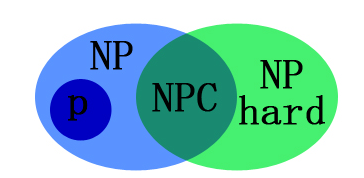

# 1. NP hard 问题

> tags:
>
> #Math Concepts
>
> #NP Hard

其实早就听说过NP hard问题很难解，但是一直没有正式地去了解它。这次阅读了一些博客教程，大致了解了下该问题，弄懂了其概念（不看具体例子会有点绕嗷）。内容其实不少，有不少新奇的概念呢，这里只列出参考文献，自己发懒就不记笔记了（这个记了也是抄概念...）

* 很全的博客https://blog.csdn.net/qq_23947237/article/details/80250899
* 简略的定义https://cnblogs.com/AndyJee/p/5048556.html

