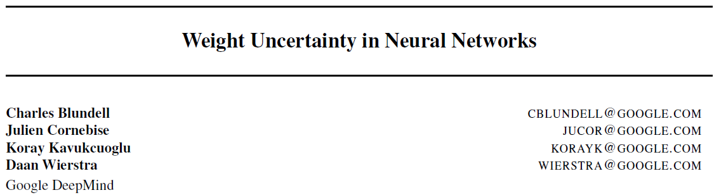

## 1. Weight Uncertainty in Neural Networks

> tags:
>
> Uncertainty

### 论文信息

* https://arxiv.org/abs/1505.05424
* 最后发布2015/03，至2020/05/12引用845
* 笔记记于2020/05/12，16
* 一篇不错的[博客](http://blog.sina.com.cn/s/blog_bf8ab3180102ztti.html)，里面有个式子有个小错误

### 内容

* 摘要
  * 提出`Bayes by Backprop`的概念，指学习神经网络中权重的概率分布的方法，方法优点甚多，包括兼容BP。推断的方法大概是最小化边际似然的下界（好像是ELBO的一部分）。
  * 该方法学习了权重的分布，效果应该和MNIST分类用dropout差不多。这种权重的分布表示了其不确定性，对非线性回归的泛化、强化学习中的`trade-off`有所帮助

* 总结
  * 核心是设计合适的目标函数（边际似然的下界），用`Bayes by Backprop`学习神经网络权重参数的不确定性。
  * 该方法只用到了梯度下降，因此可以直接沿用很多原来的神经网络训练方法。
  * 应用不错，在提出的实验中表现优异，包括MNIST分类、非线性回归问题的预测和上下文赌博机`contextual bandits`。

* 引言
  * 问题背景：普通的前馈网络易过拟合，在很多问题中我们不要那么武断，要引入不确定性。为此提出的`Bayes by Backprop`就是一种缓和过拟合的方法，还有其它附带优点。
  * 冻鸡：至少可以完成文章提到的几个实验。。。硬核冻鸡。。。
  * `Bayes by Backprop`的关键是网络权重由各自的分布表示，那么其实采样的话就得到很多（无限）网络，即网络集成了。但此方法只是增多了一部分参数（在原来权重的参数量基础上成倍增长），却可以得到无限个网络，需要用到梯度的无偏蒙特卡洛估计（还不会）。
  * 有个问题是，参数量确实变得很大，贝叶斯本身的很多积分自然是计算不了的，所以需要近似，这大概是为什么考虑了ELBO相关的估计手段吧。
