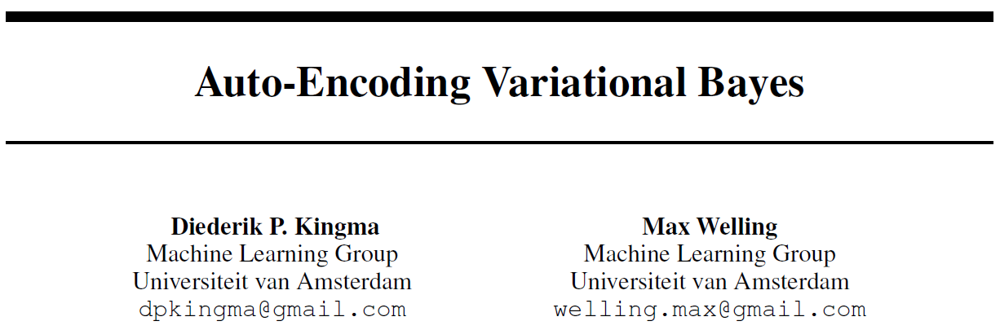

## 2. Auto-Encoding Variational Bayes

> tags:
>
> #Bayesian Neural Networks
>
> #VAE
>
> #Recognition Model

### 论文信息

* https://arxiv.org/abs/1312.6114
* 最后发布2014/05，至2020/05/16引用8604
* 笔记记于2020/05/16，但是我感觉以前看过这篇文章，现在当是复习了
* 一篇很有意思的参考：https://zhuanlan.zhihu.com/p/81170602

### 内容

* 摘要：

  针对

  * 概率模型，往往有连续隐变量和算不了的后验分布；
  * 数据集很大，那么怎么进行有效推断？

  提出随机变分推断学习算法，分两块

  * 对变分下界重参数化，这样就可以近似它，可以用梯度方法；
  * 对针对的两条问题，用变分下界的估计来拟合一个近似的推断模型，即recognition model，据说很有效。

* 引言：

  * 对针对的第一个问题

    变分贝叶斯VB方法是经典方法，方法是对算不了的后验有个近似，用优化方法。但传统的近似方法是平均场假设，需要后验对应的一些期望有解析解，就是这个也经常做不到。

    但变分下界的重参数化提供了无偏估计，这个估计称为随机梯度变分贝叶斯SGVB估计。据作者说这个估计比上面的好，简单。

  * 对针对的第二个问题，数据集大

    提出自编码变分贝叶斯AEVB算法，即用SGVB估计来优化recognition model。据作者说这个方法近似特别好，推断有效，可以方便估计参数（求导），也计算快。

    如果这个recognition model是神经网络，那就是文题所说的变分自编码器了

* 结论：

  重要的工作是变分下界的重参数化估计：SGVB估计。这个易求导，很好用，也有效。可以解决一堆VB问题。

  如果数据集大，那就用SGVB估计来优化，即使用AEVB算法。

* 方法：

  基本数据集是iid的，每个样本有各自的连续隐变量。模型用图模型表示，有全局参数和局部参数（隐变量）。全局参数用传统的ML，MAP估计，局部隐变量用变分推断，不过全局的也可以VI。

  * **recognition model**

    终于介绍它是什么了。针对正常的生成模型，真实后验$p_{\theta}(z|x)$不好算，所以用$q_{\phi}(z|x)$近似，这个$q_{\phi}(z|x)$就是recognition model。

    这个模型是隐变量分布的，相当于原数据的一种编码表示，所以这个recognition model也是一种概率编码模型。

    当然提出的方法和我现在会的东西是一致的，是一起学习两种参数，recognition model的参数，也叫变分参数$\phi$和原始生成模型参数$\theta$。

  * 变分下界的计算

    嗯，先注意下整个数据集的似然是所有数据点的似然乘积，因此很多时候用对数似然就是加和。变分下界就不介绍了，似然项=KL散度+变分下界嘛，一般就优化变分下界了。

    但是变分下界针对$\phi$的梯度，有采样方差很大的问题，这一点是个大问题，要额外参考文献[BJP12]，有时间去看看吧。

  * SGVB估计配合AEVB算法

    AEVB算法比较正常，该文实验中重参数化只取了一个样本$L=1$。

    要注意的是SGVB有两种形式喵喵喵...第一种是直接在MC估计上用重参数化的方式；第二种是大家喜闻乐见的KL散度组合重构误差的形式。在重参数化的时候有个温和条件，不过一般常见的分布都是可以的。

  * 介绍了变分自编码器的例子，感觉和VNet好像啊！

* 其它部分暂时不看
