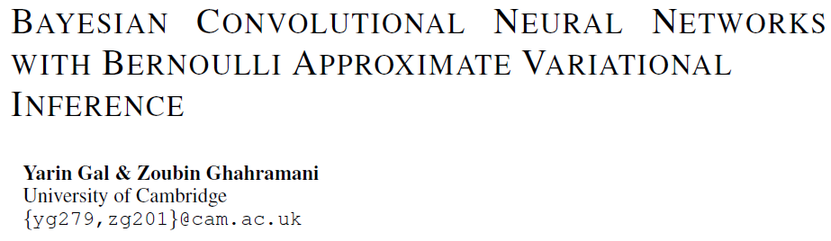

## 3. Bayesian Convolutional Neural Networks with Bernoulli Approximate Variational Inference

>tags:
>
>#Bayesian Neural Networks
>
>#CNN
>
>#VI

### 论文信息

* https://arxiv.org/abs/1506.02158
* 最后发布2015/06，至2020/05/18引用287
* 笔记记于2020/05/18, 24
* 一篇很有意思的参考：https://zhuanlan.zhihu.com/p/79715409?from_voters_page=true
* https://zhuanlan.zhihu.com/p/117636802

### 内容

* 摘要：
  * 背景信息：传统CNN拟合能力强，大数据集上效果好
  * 问题是什么：CNN拟对于少量数据容易过拟合。且很多情况下收集不到大规模数据
  * 所提方法：对CNN的核施加概率分布，并对后验做伯努利变分推断，这样无需额外参数，且可以提高其稳健性。为什么没说
  * 对比实验：训练用dropout似乎是一种近似推断的方法，所提Bayesian CNN可以与之做对比实验
* 引言
  * 简述传统CNN及其问题，贝叶斯NN有稳健性。只是大家喜欢对网络权重施加概率分布，可能由于参数多，此前无人对NN的filters引入概率分布，本文就来试试。
  * 据说以前的贝叶斯NN，后验分布推断很难，即使是Gauss，也会double参数量（√，均值和方差），这里用Bernoulli approximating variational distributions就计算方便多多。
  * 一个结论是NN的dropout可以看成高斯过程GP的近似，本文则认为可以看成贝叶斯NN的伯努利变分推断，具体网络训练中的操作我不太明白。
  * 要注意一般dropout不用于传统CNN，对测试结果影响较大；但**数学证明**表示贝叶斯CNN，即CNN+概率假设+dropout可以缓解此问题！另外，MC+dropout可能有更优的结果，但对具体问题，可能需要不同的后验近似方式。
