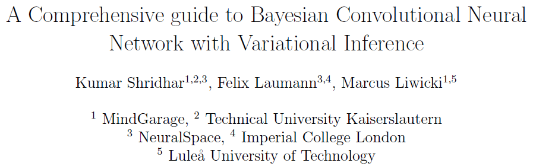

## 4. A Comprehensive Guide to Bayesian Convolutional Neural Network with Variational Inference

> tags:
>
> #Bayesian Neural Networks
>
> #CNN
>
> #VI

### 论文信息

* https://arxiv.org/abs/1901.02731
* 作者Kumar Shridhar的硕士论文就是这个，感觉这篇文章是其硕士论文的修改版
* 最后发布2019/01，至2020/05/26引用？
* 笔记记于2020/05/26

### 内容

* 摘要：
  * 背景信息：人工神经网络ANN拟合能力不错，大数据集上效果好，但是它是确定性模型，参数的估计是点估计。
  * 问题是什么：ANN在某些region（给个[doge]自行体会这个region是啥嗷）数据点少时表达不出不确定性√。
  * 所提方法：BayesCNN，对权重施加概率分布，用uncertainty那篇文章的`Bayes by Backprop`方法。其特色是：
    * 有两种不确定性的描述，分别是**aleatoric偶然和epistemic认知不确定性**，介绍写在下面。
    * 对均值和方差怎么操作？
  * 实验：终于有个在经典数据集上做实验的文章了。。。

* 引言
  * 简述传统DNN，联结主义模型，只需大量数据即可学习，不需任务的先验信息（个人感觉超参数其实就是这个）
  * 简述CNN，问题与摘要一致，不能描述不确定性。由于它容易给出过于确定的结果（即过拟合），传统解法是加正则，方法一堆，比如L1，L2，提前停止训练，weight decay，**dropout**（这个很猛啊，大家都拿它做比较！）
  * **冲突**！该文也说核上的分布描述没被做过。。。请对比*Bayesian Convolutional Neural Networks with Bernoulli Approximate Variational Inference*
  * 贝叶斯训练能给CNN带来什么：
    * 引入不确定性的描述=偶然+模型不确定性
    * 对参数添加概率分布，再取个期望（=积分）也是一种正则√
    * TBD
  * 以前的BayesCNN似乎有缺点，是推断参数后验时参数很多，计算困难，且性能提升不多！应该有对应文献，有时间去看一下√
  * 本文的BayesCNN怎么解决缺点：`Bayes by Backprop`做变分推断，就是我学的这一套，它做的假设也是高斯啊，方差就代表了一种不确定性；以及调参的方法是用L1范数使权重稀疏，达到减少参数量的目的

* 背景知识
  * 2.2.2节的局部重参数化中有个地方没懂：$Cov\[L_i, L_j\] = 0$，这个估计是如何使随机梯度的方差减小到$\dfac{1}{M}$？
  * 重头戏-**不确定性**
    * 偶然不确定性：观测样本中本身就存在的噪声，包括数据质量、数据收集中随机引入的噪声。这种不确定性一般不能通过增大数据量减小，因为这种不确定性在所有数据上一般是一致的。该不确定性又可分为两种：
      * homoscedastic不确定性，同质不确定性，是所有数据上一致的；
      * heteroscedastic不确定性，异质不确定性，有些样本本身确实有更大的噪声，这很重要，RPM，GMM等很多方法其实都考虑这种异常点点影响。
      **这种不确定性由模型输出上的分布度量**
    * 认知不确定性：是模型引入的不确定性。一般数据量增大可以减小之，这是很直观的结论。这种不确定性由模型参数上的分布度量，当模型获取更多训练数据时，模型参数的变化就反应了分布的不确定性。
  * 模型参数微调，即Model Pruning，试图减小参数量，使之稀疏，计算加快但不影响模型性能。最简单的方法就是参数值小的直接设为0，方法是对参数加稀疏正则，但是L0正则不可导，所以一般用L1正则。要**小心**的一点是L1范数在0处不可导！

* 本文BayesCNN
  * 网络的话就是对CNN的核添加概率分布，当然最后FC层的权重也有概率分布，**注意**什么池化层可能有操作模拟使之成为完全的BayesCNN。
  * **局部重参数化**的操作我明白，不对模型权重直接采样而是对激活进行重参数化，这样求导什么的会非常方便嘛。不过（7）式中的感受域和方差的系数怎么来的不清楚，可能与Sigmoid的计算有关，我先不管了，有空手算一遍。
  * **均值和方差的运算操作**，又是一个没搞懂的。啊，这个convolutional指卷积过程中所需操作。第一步先对激活操作，正常用Adam获取均值的更新，这本质上是均值的MAP估计；第二步更新方差，惊奇发现咦方差项包含均值和一个系数，所以Adam再更新此系数。。。大概就是这些个意思，具体实验的细节操作吧。。。
  * **不确定性的具体推导**，文中的（8，9，10）式都没问题，从预测分类的概率，按模型参数积分取期望，然后积不出来了，就用期望的形式取了（12）式的无偏估计✅。接下来就无敌了，（13）式这个方差**我又犯迷糊了**。。。后面（14，15）是抄文献的已查明！至于为什么这两项对应两种不确定性请再查阅文献🆗

* 后面的实验和案例暂时不看

* 结论应该和摘要引言差不多，真的能bb。。。注意下future work的思路，什么后验sharpening，初始化方式；以及贝叶斯生成式网络的构建～
