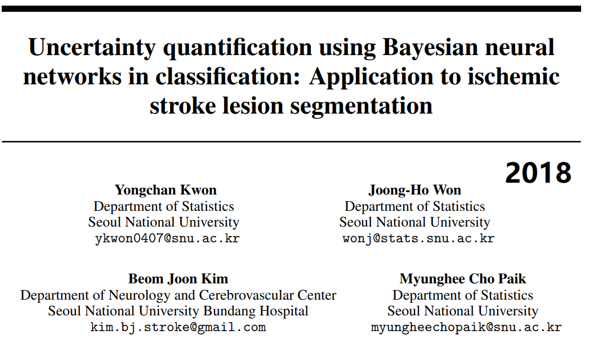

## 5. Uncertainty quantification using Bayesian neural networks in classification: Application to ischemic stroke lesion segmentation

> tags:
>
> #Bayesian Neural Networks
>
> #Uncertainty
>
> #Uncertainty Quantification

### 论文信息

* https://openreview.net/pdf?id=Sk_P2Q9sG
* 2018年的论文，作者韩国首尔国立大学，这个文章好像既是*1st Conference on Medical Imaging with Deep Learning (MIDL 2018)* 的文章也是 *Neural Information Processing Systems 2017 Workshop on ‘Medical Imaging meets NIPS’* 的文章。至2020/05/27引用量20
* 笔记记于2020/05/27

### 内容

* 摘要：
  * 首先我要说韩国兄弟写的摘要看着很舒服啊，一下就看完了
  * 背景：CV中的分类以前都是点估计，大家都调整网络参数或者结构来增加准确率
  * 主要问题：原来的分类网络是点估计，确定性模型，因此缺乏不确定性。尤其是对于实际问题，比如医学图像分类分割，会面临重要的**明智决定informed decision**和预测质量等**安全性**挑战✅
  * 提出解决方法：BayesCNN，及其不确定性分解表示，这个分解十分自然也有解释意义，即我在文献4中提到的**aleatoric偶然不确定性和epistemic模型不确定性**✅
  * 然后在缺血性中风病灶分割挑战上完成实验验证✅

* 引言：
  * 依旧先介绍背景：DNN在CV中表现出色，但预测结果的不确定性很少被关注。
  * **为何**需要不确定性量化与概率解释：
    * 需要对模型输出（预测结果）有充足的解释
    * DNN过拟合啊，在确定性框架下它可能会给出**spuriously high confidence**虚假的高确定性结果
  * 本文的BayesCNN是用别人的工作，之前有个NN的dropout可以看成GP高斯过程近似的结论（在第3中），具体当时也没看，后续有空要补。而且在第二章的解释中，它是对所有网络参数添加概率分布假设，然后通俗地来了个后验和分类的预测分布。所以呢其后验的计算自然是恶心啦，所以又用VI去近似（作者先介绍了几个传统近似方法，Laplace估计和MCMC），VI近似使得原本的贝叶斯积分问题变成了优化问题。
    * **Restricted family Q would help scalability but hurt approximation**，记住这个说法，但是怎么翻译呢？毕设里我自己写了一个类似的，这里我却翻译不通。。。
    * 它这个应该是基于Gal2016的文章，好像是博士毕设...大概指dropout NN（等价于某种BayesCNN）
  * **本文的不确定性为什么好**：不是explicitly直接modeling定义的，而是自然由多项分布的均值和方差的形式导出来的（在4中有同样的式子还记得吧🤭），由4中当时的笔记也知道**没有再引入额外参数**（直接定义好像会引入额外参数）
  * 此外做了两个ISLES实验，好像有两个重要的解释：interpretable uncertainty maps不确定性图，和模型不确定性与有效样本量的关系。

* 结论：
  * 肯定一下工作，对这种BayesCNN的不确定性进行自然分解，得到两种有解释意义的不确定性。优点之一是偶然的不确定性被表示由输出分布表示；优点之二是计算上有数据稳定性（还不知道为啥。。。）。
  * Emmm，作者说**variational variability**（这是什么玩意...）变分可变性不是后验方差的好近似...可能是指不确定性是变分推断之后算的...
  * **此些不确定性可能能用于一般的贝叶斯框架**，最后举了几个例子，大概就是贝叶斯模型的一些假设换了换

* **重头戏：分类任务中不确定性的分解**
  * 这个分解还是可以的，（2）式用了Fubini定理和对角算子和期望可交换性，证明在附录里，基本上能看明白，**但是**，这一节3.1节中最后一段话没看明白！我把它理解为输出$y^{\*}}$与之对应的概率$p(w)$等价，这样式子可以解释，但是提到模型不确定性的时候我一下子就懵了，你怎么知道这个是来自于data的？
  * 3.2节本文所提方法，我感觉是启发式的，*用方差对应的项作为偶然不确定性，确实这种可以理解成数据的随机误差导致的，所以说是偶然不确定性；用均值对应的项作为模型不确定性，均值毕竟是某种确定的东西，这种误差可以理解成模型与实际的差异，所以是模型不确定性*。进一步地，之前的笔记（好像就是4）提到分类问题中方差恰好称为均值的函数，这样就为了避免矩阵方差一起，参数量成为2倍，所以考虑直接用概率表示...非常直觉，原文**没有提任何理论证明**。。。

* 我自己的感受：

  我很喜欢这个不确定性分解的式子和证明。不过后面文章自己提出的形式（应用到笔记4中了），感觉太直接了反而不是很理解，毕竟没证明嘛。
  
  我猜这个是沿用了它的一个参考文献中的说法，下一步就去看看那个文献了。就酱
