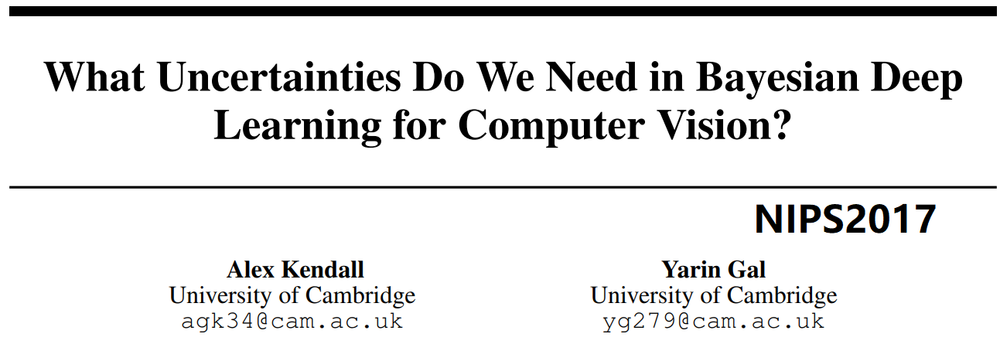

## 6. What Uncertainties Do We Need in Bayesian Deep Learning for Computer Vision

> tags:
>
> \#Bayesian Neural Networks
>
> \#Uncertainty

### 论文信息

* http://papers.nips.cc/paper/7141-what-uncertainties-do-we-need-in-bayesian-deep-learning-for-computer-vision
* NIPS2017，至2020/05/28引用量？
* 笔记记于2020/05/28，29
* https://blog.csdn.net/weixin_39779106/article/details/78968982

### 内容
* 摘要，很直白：
  * 定义：**直接声明**有两种不确定性，与输入样本相关的aleatoric和给够数据就没的epistemic不确定性，之前的笔记我已提过
  * 背景：以前CV问题中这两个不好建模，现在在Bayes深度学习框架下可以解决了
  * 所提方法：提出BayesDNN框架下两种不确定性结合的模型，并在语言分割和深度回归（啥？）问题上实验，总之一个分类一个回归涵盖两种基本问题，作者说结果是SOTA的。顺手**由不确定性的公式导出新的损失函数**，可视为一种**learned attenuation**，使损失更**稳健**。**我提问了**：这个学到的衰减是指希望神经网络学习时降低不确定性，所以叫**学到的不确定性衰减**么？

* 结论：
  * 提出BayesDL（DNN）框架，结合两种不确定性得到新的损失函数，增强了稳健性，并在实验中达到SOTA
  * 偶然不确定性在数据集大，以及实时应用的模型情形下很重要；模型不确定性在数据集小，以及重视安全性（实时应用其实应该也有安全性问题）的情形下很重要。
  * 提出未来方向：实时应用下的模型不确定性研究，emmm知道有这回事就算了

* 引言：
  * 背景是理解模型不知道什么是个很严肃的问题，毕竟现在DL基本上都是黑箱嘛。举了两个严重的安全问题为例，特斯拉自动驾驶的判别失误导致的交通事故和人脸识别失误导致的可能种族歧视问题（？）
  * 当前CV任务中也有不确定性，有一些传统度量方法：
    
    粒子滤波方法、条件随机场方法可以度量一些不确定性；而DNN效果非常好，但不能直接捕捉意义明确的不确定性。
    
    **因此**引入贝叶斯神经DNN，希望**既有好的效果也能量化不确定性**
  
  * 给了个图1，生动形象地解释了两种不确定性的区别，我好了🤭
  
  * 注意偶然不确定性**还包括**同质、异质不确定性。之前的笔记一直只认识到偶然和模型不确定性的区别，也一直忘了有这两种子分类
  
  * 似乎单独建模偶然不确定性很难，会有代价；因此所提出的统一贝叶斯DNN框架，**对两种不确定性有trade-off**，应该是学了个映射，从输入数据到偶然不确定性，在与模型不确定性结合，做出某种权衡。
